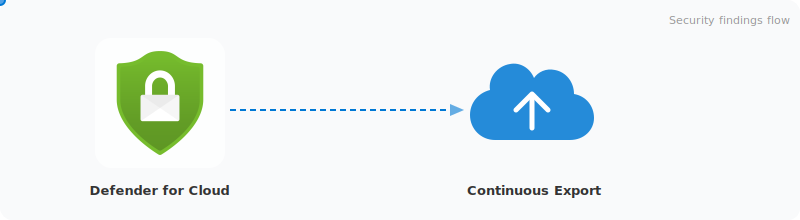

# Microsoft Defender for Cloud - Export Solutions

Export and analyze **Microsoft Defender for Cloud** findings using multiple pipeline options.

<p align="center">
  
</p>

## Concepts

New to the Azure services in this pipeline? Start here:

| Concept | What it does |
|---------|-------------|
| [Continuous Export](docs/concepts/Continuous-Export.md) | Streams Defender findings to Event Hub or Log Analytics in near-real-time |
| [Event Hub](docs/concepts/Event-Hub.md) | Buffers streaming events with partitioning and consumer groups |
| [Stream Analytics](docs/concepts/Stream-Analytics.md) | Processes events in real time using SQL-like queries |
| [Azure SQL Database](docs/concepts/Azure-SQL-Database.md) | Stores deduplicated findings in typed tables |
| [Azure Resource Graph](docs/concepts/Azure-Resource-Graph.md) | Cross-subscription KQL queries - zero infrastructure required |

## Repository Structure

```
├── automation/                     # Standalone analysis & export scripts
│   ├── Setup-ContinuousExport.ps1 # Configure Continuous Export on subscriptions
│   └── output/                    # Generated reports and Power BI setup scripts
│
├── solutions/
│   ├── streaming-sql-pipeline/    # Streaming: CE → Event Hub → Stream Analytics → SQL
│   │   ├── README.md              # Deployment guide, schema reference, troubleshooting
│   │   ├── Setup-Guide-Manual.md  # Manual deployment walkthrough (Portal + SQL)
│   │   ├── Stream-Analytics-SQL-Pipeline.md  # Deep-dive: CE format, ASA queries, MERGE internals
│   │   └── bootstrap/             # Automated SQL bootstrapping (PowerShell + SQL)
│   │
│   └── resource-graph-export/     # Point-in-time Azure Resource Graph queries
│       ├── Export-ArgFindings.ps1  # ARG-based findings export
│       ├── Export-ForPowerBI.ps1   # Power BI export (CSV & Log Analytics modes)
│       └── resourcegraph.kql      # KQL queries for ARG
│
└── .infra/
    └── sql/                        # Terraform for streaming pipeline infrastructure
        ├── main.tf                 # All resources (~15 resource types)
        ├── variables.tf            # Input variables with defaults
        ├── outputs.tf              # Resource IDs, FQDNs, pipeline summary
        ├── providers.tf            # azurerm ~4.0 + azapi providers
        └── terraform.tfvars.example # Example variable values
```

## Solutions

| Solution | Path | Description |
|----------|------|-------------|
| **Streaming SQL Pipeline** | `solutions/streaming-sql-pipeline/` | Continuous Export → Event Hub → Stream Analytics → Azure SQL. Full pipeline with staging tables, MERGE stored procs, and Elastic Job scheduling. Deployed via Terraform + bootstrap scripts. |
| **Resource Graph Export** | `solutions/resource-graph-export/` | Azure Resource Graph queries. Lightweight, no infrastructure needed. Point-in-time exports only (no streaming). |

## Quick Start - Streaming SQL Pipeline

```bash
# 1. Deploy infrastructure
cd .infra/sql/
cp terraform.tfvars.example terraform.tfvars   # edit with your values
terraform init && terraform apply

# 2. Run bootstrap (schema + permissions + Elastic Job schedule)
cd ../../solutions/streaming-sql-pipeline/bootstrap/scripts/
./Initialize-Bootstrap.ps1 \
    -SqlServerFqdn "$(terraform -chdir=../../../.infra/sql output -raw sql_server_fqdn)" \
    -ElasticJobUmiName "$(terraform -chdir=../../../.infra/sql output -raw elastic_job_umi_name)" \
    -ElasticJobUmiClientId "$(terraform -chdir=../../../.infra/sql output -raw elastic_job_umi_client_id)" \
    -AsaAssessmentsPrincipalName "asa-defender-assessments" \
    -AsaSubAssessmentsPrincipalName "asa-defender-subassessments" \
    -SkipDatabaseCreation -SkipMasterUser

# 3. Done - bootstrap starts ASA jobs automatically
```

See [streaming-sql-pipeline/README.md](solutions/streaming-sql-pipeline/README.md) for the full walkthrough.