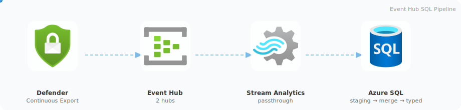

# Event Hub SQL Pipeline

Real-time ingestion of **Microsoft Defender for Cloud** findings into Azure SQL Database using a staging-then-merge pattern.

  

## How it works

Continuous Export streams security assessments and sub-assessments to Event Hub. Stream Analytics writes events as-is into raw staging tables. An Elastic Job runs a MERGE stored procedure every 10 minutes to deduplicate, parse the ARM JSON, and upsert into typed tables.

## What gets deployed

| Resource | Purpose |
|----------|---------|
| Event Hub Namespace + 2 Hubs | Receive Continuous Export events |
| Azure SQL Server (Entra-only) | Logical SQL server |
| 2 SQL Databases | Findings storage + Elastic Job metadata |
| 2 Stream Analytics Jobs | Passthrough from Event Hub to SQL |
| Elastic Job Agent + Managed Identity | Scheduled MERGE execution |
| 2 CE Automations | Defender for Cloud → Event Hub export |

For a detailed resource breakdown, see the [automated setup guide](Setup-Guide-Automated.md#what-gets-deployed).

## Key concepts

| Concept | Role in this pipeline |
|---------|----------------------|
| [Continuous Export](../../docs/concepts/Continuous-Export.md) | Entry point - streams findings to Event Hub |
| [Event Hub](../../docs/concepts/Event-Hub.md) | Buffers events with partitioning |
| [Stream Analytics](../../docs/concepts/Stream-Analytics.md) | Passthrough writer from Event Hub to SQL |
| [Azure SQL Database](../../docs/concepts/Azure-SQL-Database.md) | Stores deduplicated findings in typed tables |

## 📖 Guides

Step-by-step deployment instructions. Choose the approach that fits your environment.

| Guide | Description |
|-------|-------------|
| [Setup Guide - Automated](Setup-Guide-Automated.md) | **Recommended** - Deploy with Terraform + bootstrap scripts |
| [Setup Guide - Manual](Setup-Guide-Manual.md) | Step-by-step deployment via Azure Portal and SQL tooling |

## 📚 Reference

Technical deep-dives and supporting resources.

| Document | Description |
|----------|-------------|
| [Stream Analytics SQL Pipeline](Stream-Analytics-SQL-Pipeline.md) | CE event format, ASA queries, MERGE internals, scheduling alternatives |
| [Bootstrap package](bootstrap/) | SQL bootstrapping scripts, parameters, and file reference |
| [Terraform infrastructure](../../.infra/sql/) | IaC definitions for all Azure resources |
